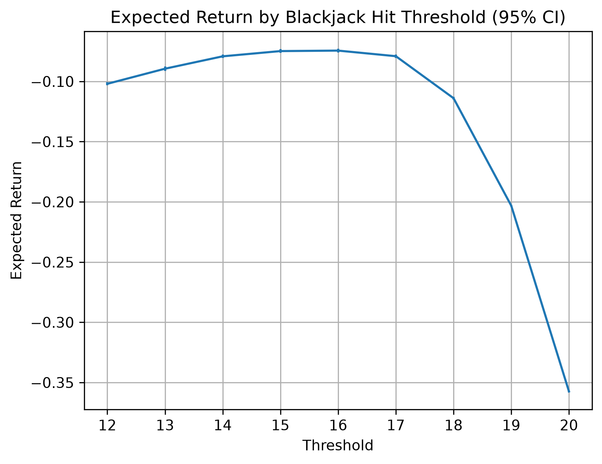

# BLACKJACK PROJECT

# Blackjack Strategy Simulator

A Python Blackjack game and Monte Carlo simulation framework for analysing the performance of different playing strategies.

This project was originally developed as my final project for Harvard's **CS50P: Introduction to Programming with Python**. The original version was an interactive command-line Blackjack game supporting multiple players against a computer-controlled dealer.

I have since extended the project into a quantitative simulation and data-analysis framework for investigating Blackjack strategies using Monte Carlo methods.

## Features

The project currently supports:

- Interactive command-line Blackjack for a configurable number of players
- Standard 52-card deck generation and shuffling
- Blackjack hand valuation, including hard and soft Ace values
- Automated dealer behaviour
- Automated player strategies
- Simulation of large numbers of Blackjack hands
- Calculation of win, loss, push and bust rates
- Estimation of expected return for different strategies
- Repeated Monte Carlo experiments
- Export of raw experimental results to CSV
- Statistical analysis using NumPy and pandas
- Visualisation using matplotlib
- Estimation of standard errors and 95% confidence intervals
- Automated testing using pytest

## Project Structure

```text
.
├── project.py
├── test_project.py
├── experiment.py
├── analysis.py
├── requirements.txt
├── README.md
└── results/
    ├── threshold_results.csv
    ├── threshold_summary.csv
    └── threshold_expected_return.png
```

### `project.py`

Contains the core Blackjack game and simulation engine, including:

- deck creation and shuffling
- hand representation and valuation
- interactive Blackjack gameplay
- automated strategy logic
- automated hand execution
- individual game simulation
- repeated Monte Carlo simulation

### `test_project.py`

Contains the pytest test suite for the Blackjack engine and simulation functions.

### `experiment.py`

Runs Monte Carlo experiments and saves the raw results to CSV.

### `analysis.py`

Loads the experimental results using pandas, calculates summary statistics and confidence intervals, and generates visualisations.

### `results/`

Contains the raw experimental data, derived statistical summaries and generated figures.

---

# Experiment 1: Hit Threshold Strategies

## Research Question

**How does the hand value at which a player stops hitting affect their expected return in Blackjack?**

To investigate this, I implemented a family of simple threshold strategies.

A threshold strategy follows the rule:

> Hit while the player's hand value is below the chosen threshold, and stand once the threshold is reached or exceeded.

For example, a threshold of 16 means that the player will hit on any hand worth less than 16 and stand on any hand worth 16 or more.

These strategies deliberately use only the player's own hand value and do not yet consider the dealer's visible card.

## Method

Thresholds from **12 to 20** were tested using repeated Monte Carlo simulation.

For each threshold:

1. A standard 52-card deck was created and shuffled.
2. Cards were dealt to one automated player and the dealer.
3. The player followed the specified threshold strategy.
4. The dealer hit below 17 and stood on 17 or above.
5. The final outcome was recorded.
6. The process was repeated across multiple independent simulation runs.

For every run, the program records:

- number of games
- wins
- losses
- pushes
- player busts
- dealer busts
- win rate
- loss rate
- push rate
- expected return

The complete run-level dataset is stored in:

[`results/threshold_results.csv`](results/threshold_results.csv)

## Expected Return

For this experiment, outcomes are assigned the following returns:

- Win: **+1**
- Loss: **-1**
- Push: **0**

The estimated expected return is therefore:

```text
Expected Return = (Wins - Losses) / Number of Games
```

This provides a single measure with which to compare strategies rather than considering win rate alone.

## Statistical Analysis

Because Monte Carlo estimates vary between simulations, multiple independent runs were performed for each threshold.

The results were analysed using **pandas** and **NumPy**.

For each threshold, the analysis calculates:

- mean expected return
- sample standard deviation
- standard error
- 95% confidence interval

The derived statistics are stored in:

[`results/threshold_summary.csv`](results/threshold_summary.csv)

The confidence intervals account for uncertainty in the estimated mean expected return across the repeated simulation runs.

## Results



The results show a clear relationship between the hit threshold and expected return.

Performance improves as the threshold increases from 12 towards the middle of the tested range. Thresholds **15 and 16 produced almost identical mean expected returns**, at approximately **-0.075 units per hand** in the current experiment.

Performance then deteriorates as the threshold increases further. The estimated mean expected returns were approximately:

| Threshold | Mean Expected Return |
|---:|---:|
| 12 | -0.104 |
| 13 | -0.084 |
| 14 | -0.083 |
| 15 | -0.075 |
| 16 | -0.075 |
| 17 | -0.086 |
| 18 | -0.121 |
| 19 | -0.204 |
| 20 | -0.354 |

The deterioration at high thresholds is substantial. A player waiting until 20 before standing performs considerably worse than strategies that stand around 15–17.

The 95% confidence intervals also demonstrate that Monte Carlo estimates contain sampling uncertainty. In particular, the results do not justify treating the small difference between thresholds 15 and 16 as evidence that one is definitively superior to the other.

A more appropriate conclusion from this experiment is that **thresholds around 15–16 performed similarly under the simplified rules of the simulator, while overly conservative strategies performed substantially worse**.

## Monte Carlo Convergence

During development, I also investigated how the number of simulated hands affected the stability of the expected-return estimate.

Small simulations produced highly variable estimates. For example, repeated simulations of only 100 hands could make the same strategy appear either profitable or strongly unprofitable.

As the number of simulated hands increased, the estimates became substantially more stable.

This provided an empirical demonstration of Monte Carlo convergence and motivated the use of larger samples and repeated simulation runs for the strategy comparison.

---

# Original Blackjack Game

The simulation framework is built on the original interactive Blackjack game developed for CS50P.

## Hand Representation

Each hand is represented by a `Hand` class containing the cards currently held by the player or dealer.

The class provides methods for:

- storing cards
- calculating the Blackjack value of a hand
- handling Aces dynamically as either 1 or 11
- displaying hard and soft hand values
- producing a readable string representation of the cards

For example, an Ace and a 7 can be displayed as `8/18`, reflecting the two possible Ace values.

## Interactive Gameplay

The original game allows a configurable number of human players to compete independently against the dealer.

Players can repeatedly choose to:

- hit
- stand

until they stand or exceed 21.

The dealer follows an automated strategy of hitting below 17 and standing on 17 or above.

The final player and dealer hands are then compared to determine the outcome.

---

# Simulation Architecture

The original interactive game was refactored so that game mechanics and decision strategies could be separated.

A strategy receives information about a hand and determines whether to hit or stand.

This allows the same Blackjack engine to be used by both interactive and automated players.

The current simulation pipeline is:

```text
Strategy
   ↓
Automated Hand
   ↓
Simulated Game
   ↓
Repeated Monte Carlo Simulation
   ↓
Raw Experimental Data
   ↓
pandas / NumPy Analysis
   ↓
Statistical Summary
   ↓
matplotlib Visualisation
```

This separation allows new strategies to be added without rewriting the underlying game mechanics.

---

# Technologies

- **Python**
- **NumPy**
- **pandas**
- **matplotlib**
- **pytest**
- **CSV**

---

# Installation

Clone the repository and install the required packages:

```bash
pip install -r requirements.txt
```

## Run the Interactive Game

```bash
python project.py
```

The number of players can be specified using:

```bash
python project.py --players 3
```

## Generate Experimental Data

```bash
python experiment.py
```

This generates the raw threshold-strategy simulation data.

## Analyse the Results

```bash
python analysis.py
```

This reads the saved experimental data, calculates summary statistics and confidence intervals, and generates the expected-return figure.

## Run the Tests

```bash
pytest
```

---

# Limitations

The simulator currently uses a simplified version of Blackjack.

It does not yet model:

- splitting
- doubling down
- insurance
- natural Blackjack payouts
- multiple-deck shoes
- card counting

The current threshold strategies also ignore information contained in the dealer's visible card.

The results should therefore be interpreted as analysis of the strategies **under the rules implemented by this simulator**, rather than as estimates of returns under every form of casino Blackjack.

---

# Future Work

The next stage of the project will investigate **dealer-aware strategies**.

Rather than making decisions based only on the player's hand value, these strategies will also condition their decisions on the dealer's visible card.

This will allow the project to investigate a broader question:

> **How much does additional information improve decision-making under uncertainty?**

Future extensions may also include:

- comparison with Blackjack basic strategy
- richer hand-dependent strategies
- analysis of the value of the dealer's upcard
- additional visualisations
- more realistic Blackjack rules
- larger-scale simulation experiments

---

# Background

This project began as my final submission for Harvard's **CS50P: Introduction to Programming with Python**.

The original objective was to build a functional Blackjack game while applying Python concepts including classes, functions, command-line arguments, testing and program structure.

The project has subsequently been extended beyond the original course requirements as a way of developing skills in:

- simulation
- probability
- statistical analysis
- scientific Python
- data analysis
- experimental design
- quantitative programming


#### Description Of Project.py Gamespace:
This project creates a blackjack casino game, that deals hands to a given amount of players, which compete against a dealer controlled by the code. The program is initialised by calling the program name, with an optional --players input after, which can be used to change the amount of players (excluding the dealer) that are dealt in (default value is 1).
Firstly, a standard deck of cards is generated (52), which contain Ace-King of each suit, using createdeck(). The deck is the shuffled, using the random library, and then dealt to the given amount of players and the dealer. In the instance that there are more cards required to be dealt than there are in the deck, a Value Error is raised, as is consistent across the project. After informing the players of the dealers 'face up card', each player is in turn told their cards, and the value of their hand (including hard/soft aces), and then asked whether they want to hit or stand, until they stand or they bust. If the player busts (over 21) they are informed, and their turn ends. Once all players have completed their turns, the dealer also undertakes the process, with the decisions made for them (hit on 16, stand on 17). Each hand is then in turn compared to the dealers, and each player is informed if they won, lost or tied.

### Structures
#### Hand
Hand holds a set of given cards, having been initialised to be empty, and added to using hand.cards as a getter/setter. The functions of Hand are:

**cards()** (getter/setter), which allow for the cards in the hand to either be appended to, or seen

**value()** which outputs the value of the hand, counting aces as 11, unless that will cause the hand to bust, in which case it will be a 1, and any picture cards to be a 10

**display_value()** which outputs not just the value of the cards, but if there is an ace counting as an 11 present, also the alternate value the hand could be when the ace counts as 1 instead

**str()** which outputs the hand as a string "n of suit, n of suit..."

### Functions
#### createdeck()
This function creates a standard deck of 52 cards
#### shuffledeck(deck)
This function shuffles the input deck
#### dealhands(deck, hands)
This function deals hands to to the given number of players plus the dealer from the top of the given deck. hands is the set of Hand structures that will be dealt into, which has been initialised in the main function to be the size of all players plus the dealer. When each card is added to a hand, it is removed from the deck. If a hand is attempted to be dealt to, and there are no cards left in the deck, a Value Error will be raised
#### hit_or_stand(hands, deck)
This function allows each player to undertake their turn. It outputs the players current hand value (including if the value is 'soft'), and prompts the player to either hit or stand (h/s). If "h" entered, a card is dealt from the top of the deck and added to the players hand, and if they have not busted, they will be prompted again. If they have busted, they will be informed, and their turn will end. If the playe instead enters "s", their turn will end. Finally, if the player enters anything other than a case-insensitive, space insensitive "h" or "s", they will be reprompted, with an error message of their invalid choice.
#### dealers_turn(hands, deck, hand_values)
This function undertakes the dealers turn, with inputs of everyone's hands (including the dealers originally first two dealt cards), the remaining deck and the hand values of all other players. If all players have busted, it accepts the victory, and the dealer does not deal any cards. Else, if the dealers hand is worth less than 17, they must hit. If worth 17 (both hard or soft) or more, the dealer must stand. If the dealer attempts to hit, and there are no cards in the deck, a Value Error is raised.

#### result_hand(player_hand, dealer_hand)
This function decides what phrase to output, depending on whether the player or dealer wins (or if there is a tie) and the manner in which they win it (bust or not).
